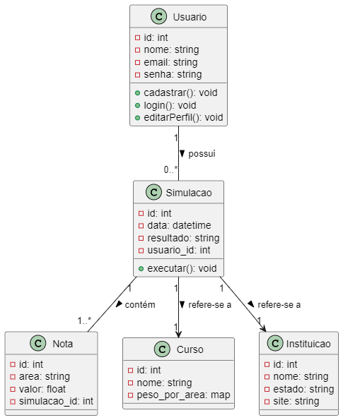

# Sistema web informativo sobre o Exame Nacional de Ensino Médio (ENEM).

## Visão Geral do Projeto e Sistema:

O EnemWay é uma plataforma web desenvolvida para ajudar estudantes com o entendimento melhor das suas notas no ENEM e como utilizá-las para ingressar no Ensino Superior. Através de uma interface intuitiva e acessível, o sistema fornece informações detalhadas sobre programas como, SISU, PROUNI e FIES, além de oferecer um simulador de notas que permite visualizar a probabilidade de aprovações. 

O objetivo deste projeto é proporcionar aos usuários e estudantes um guia interativo e personalizado para auxiliá-los no processo de escolha de cursos e instituições, baseando-se no desempenho individual no ENEM, ou seja, a plataforma busca: Facilitar o entendimento sobre os programas educacionais e seus critérios de elegibilidade; Simular o cálculo de notas de forma que permita aos usuários inserirem suas notas e visualizar possíveis ingressos com notas de cortes anteriores; Acompanhar notas de corte, o que os ajuda a planejar escolhas estratégicas; Personalizar a experiência com o salvamento das simulações, cursos e atualizações relevantes. 

Portanto, o EnemWay busca preencher uma lacuna muito presente ainda nos dias atuais: a dificuldade que muitos estudantes possuem para compreender como as suas notas no ENEM influenciam suas chances de ingresso no Ensino superior, o projeto busca preencher esta lacuna de maneira informativa e prática, permitindo que os usuários tomem decisões mais seguras e embasadas sobre seu futuro no ensino.

## Requisitos Gerais do Sistema:

Com o objetivo do projeto apresentado, é importante destacar como o sistema deve funcionar. Nesta pequena seção serão apresentados suas funcionalidades e restrições através da especificação de requisitos, cada requisito levantado deve possuir seu nível de prioridade dentro do projeto, esses níveis e suas descrições foram descritos antes das elicitações para elucidar o leitor.

[O] Obrigatório - Requisitos sem o qual o sistema não poderá entrar em funcionamento.

[I] Importante - Requisitos fundamentais, mas que não impedem que parte do sistema entre em funcionamento.

[D] Desejável - Requisitos que não impedem a entrada em funcionamento do sistemaa sem sua implementação, podendo ser contemplado posteriormente. 

## Elicitação de Requisitos – EnemWay

---

## Requisitos Funcionais

| Código | Requisito Funcional | Descrição | Prioridade |
|--------|----------------------|-----------|------------|
| RF-01 | Informações sobre os processos | O site deve apresentar informações detalhadas sobre os processos como: ENEM, SISU, PROUNI e FIES, como funcionamento, cronogramas e regras. | O |
| RF-02 | Calendário Unificado | O site deve exibir um calendário unificado do ano atual com todas as datas importantes, com base nas informações públicas disponíveis. | O |
| RF-03 | Sites oficiais | O site deve apresentar os sites oficiais de cada processo, além do site unificado do governo para inscrições. | O |
| RF-04 | Cadastro de usuários | O site deve permitir o cadastro de usuários por meio de um formulário com nome, e-mail e senha. | O |
| RF-05 | Login | O site deve permitir login com e-mail e senha. | O |
| RF-06 | Logout | O site deve permitir que o usuário realize logout sempre que desejar. | I |
| RF-07 | Manter dados cadastrais | O sistema deve manter dados do usuário e simulações armazenados no banco de dados. | O |
| RF-08 | Atualizar cadastro | O usuário poderá atualizar seus dados no "gerenciamento de perfil". | I |
| RF-09 | Inserção de notas do ENEM | O usuário poderá inserir suas notas por área de conhecimento através de formulário. | O |
| RF-10 | Simulador de notas | O site deve ter um simulador que calcula as chances de aprovação com base nas notas de corte. | O |
| RF-11 | Pontuações variadas | O simulador deve permitir simular diferentes cursos considerando pesos e notas de corte. | O |
| RF-12 | Alertas de prazos | O sistema deve exibir alertas sobre datas importantes como prova e inscrições. | I |

---

## Requisitos Não Funcionais

| Código | Requisito Não Funcional | Descrição | Prioridade |
|--------|--------------------------|-----------|------------|
| RNF-01 | Desempenho | O site deve responder em até 5 segundos ao carregar a home mesmo com muitos dados. | O |
| RNF-02 | Responsividade | O site deve funcionar corretamente em dispositivos móveis, tablets e desktops. | O |
| RNF-03 | Segurança (LGPD) | Os dados dos usuários devem ser armazenados com segurança, respeitando a LGPD. | O |
| RNF-04 | Compatibilidade | O sistema deve funcionar nos principais navegadores (Chrome, Firefox, Edge). | O |
| RNF-05 | Versionamento | O código deve estar versionado no GitHub com documentação básica. | O |
| RNF-06 | Implantação com Docker | O site deve ser implantado com Docker para facilitar portabilidade e manutenção. | O |
| RNF-07 | Atualização das notas de corte | As notas utilizadas no simulador devem ser atualizadas periodicamente com base em dados oficiais. | O |
| RNF-08 | Validação de notas | O sistema deve validar as notas inseridas (entre 0 e 1000) e exibir mensagens de erro claras. | O |
| RNF-09 | Armazenamento seguro | Os dados e simulações devem ser armazenados com segurança no banco PostgreSQL. | O |

---

## Diagrama de Classes

Diagramas de classes são utilizados para o processo de modelagem de objetos e modelagem da estrutura estática do sistema. A seguir será apresentado o diagrama de classes do Site EnemWay:

A apresentação incial do projeto finaliza em seu Diagrama de classe. Todas as outras informações serão adicionadas e sempre atualizadas no readme quando necessárias.

